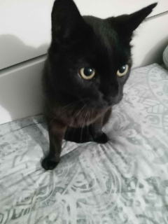

# Credits
*Thanks to everyone who uses and contributes to this project. It means a lot to us!*
## Developers
- Souldbminer - hoc-clk and loader development
- Lightos_ - hoc-clk and loader developement

## Contributors
- Dom - SOCTHERM driver
- B3711 - DVFS improvements, UV tables
- tetetete-ctrl - Website design
- TDRR - Logo design
- ppkantorski - Bugfixes and improvements
- MasaGratoR - Bugfixes and improvements
- jontomy - DVFS curve improvement

## Translators
- Samybigio2011 & Miki1304 - Italian
- angelblaster - Korean
- Redraz - Russian
- q1332348216-glitch - Simplified Chinese
- th3-ne0undr5c0r - French
- TDRR - Spanish

## Special thanks
- KazushiMe - Switch OC Suite
- ZachyCatGames - OC patches
- meha - Switch OC Suite and EOS
- deathrow - general help
- RetroNX Team - sys-clk
- NVIDIA - X1 TRM, L4T, SOCTHERM driver
- SAMSUNG Electronics - Misc. drivers
- CtCaer - Hekate, proper ram timings
- nwert - Hekate
- SciresM, hexkyz and Alula - Atmosphere

---

  

  

    In cats we trust
  

